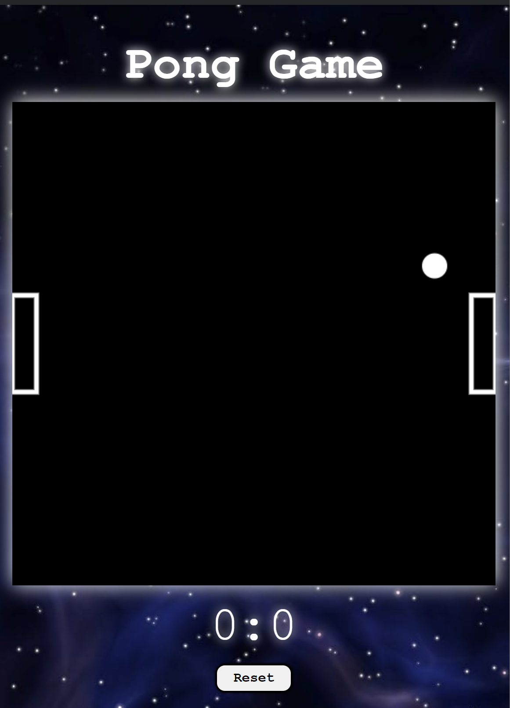
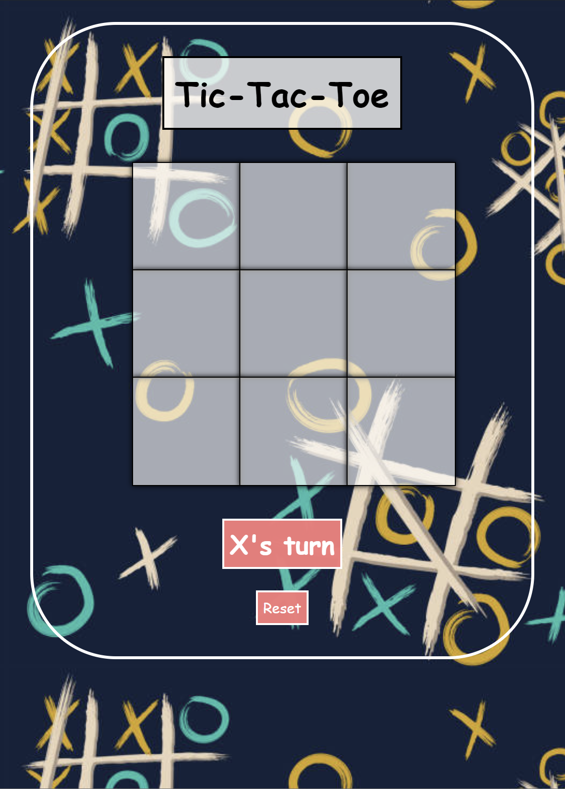
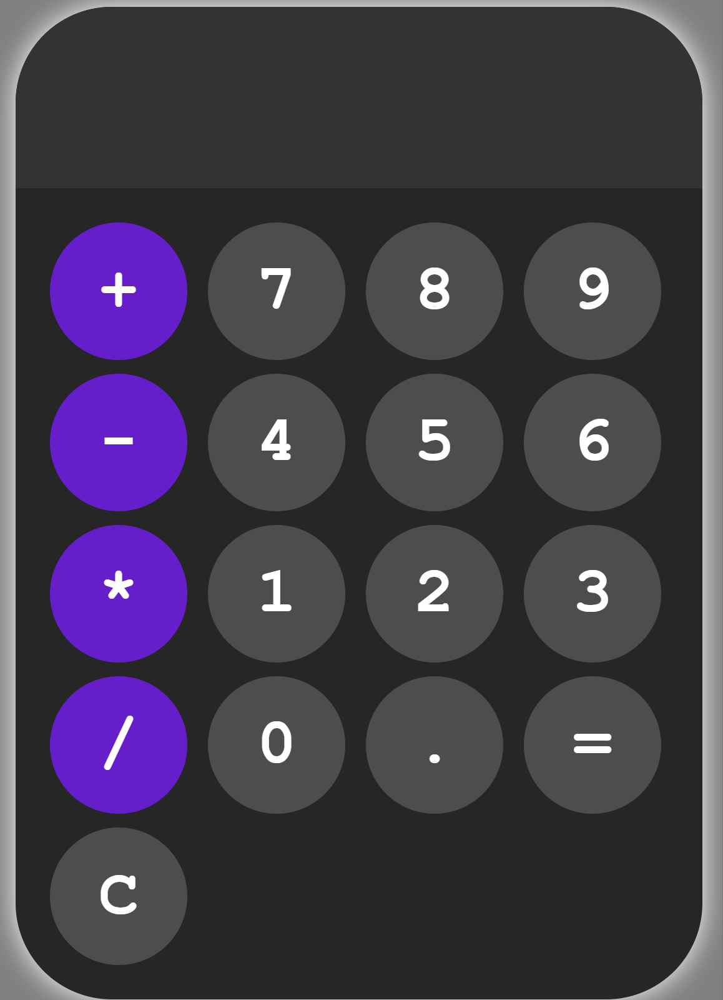
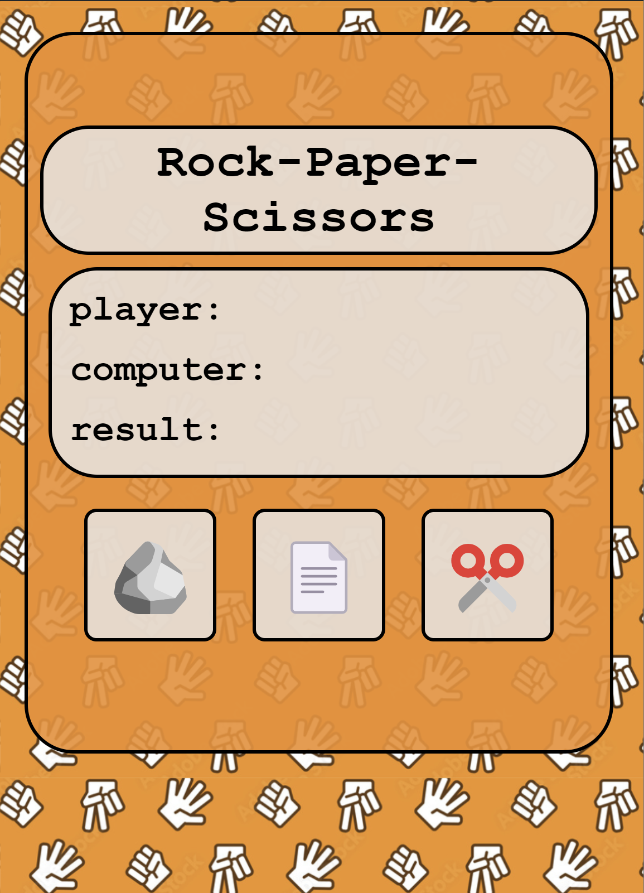
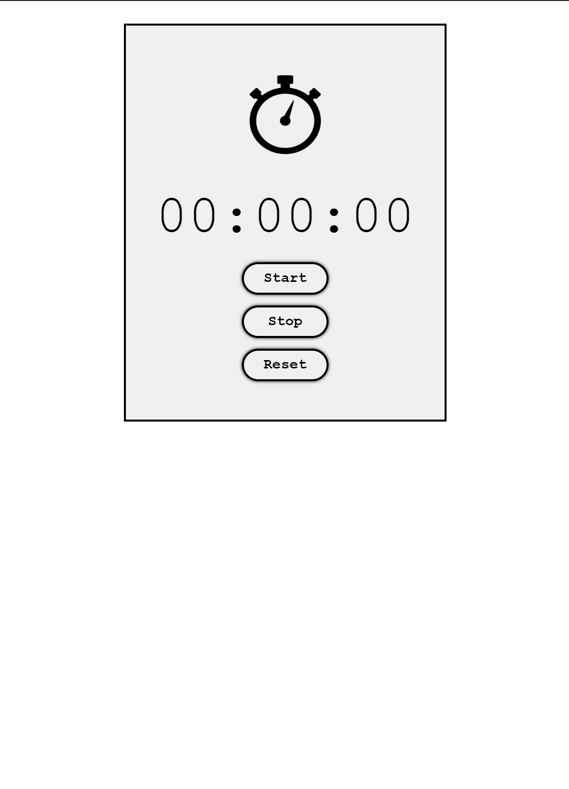

# Welcome to Interactive Web Page Project!

Thank you for checking out my project! Here, you'll find a collection of fun and interactive programs that you can enjoy right in your web browser.

## Programs Included

1. **Pong Game**
   

   - Test your reflexes in this classic arcade game!

2. **Snake Game**
   

   - Control the snake and eat as much food as you can without hitting the walls or yourself!

3. **Tic Tac Toe Game**
   

   - Challenge a friend to a game of Tic Tac Toe and see who's the ultimate strategist!

4. **Calculator**
   

   - Perform simple calculations with ease using our handy calculator.

5. **Rock Paper Scissors**
   

   - Play the classic game of Rock Paper Scissors against the computer.

6. **Stopwatch**
    

   - Keep track of time with our simple stopwatch feature.

7. **Clock**
   

   - Stay on schedule with our digital clock display.

## Technologies Used

- **HTML**: Provides the structure of our web pages.
- **CSS**: Styles our web pages and adds visual appeal.
- **JavaScript**: Makes our web pages interactive and dynamic.

## How to Use

1. **Clone the Repository**: Clone this repository to your local machine using Git.
2. **Open `index.html`**: Navigate to the project folder and open the `index.html` file in your web browser.
3. **Select a Program**: Click on the image or link of the program you want to interact with and enjoy!

## Additional Information

- Each program link leads to its respective page within the project, where you can interact with the program.
- Instructions or rules for each program may be provided on its page, so be sure to check them out!
- We hope you have a great time exploring and playing with the various programs included in this project!

## About the Creator

This project was lovingly created by [Arjun Shetty](https://www.github.com/shettyarjun). If you have any questions, feedback, or just want to say hello, feel free to reach out!

Enjoy your interactive journey!
